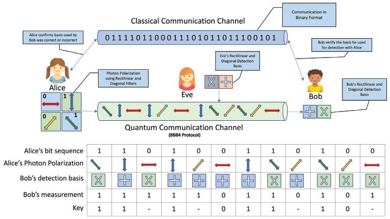

# BB84

Here,I have tried to perform a basic implementation of the BB84 protocol using python and qiskit.

<h3>BB84 protocol is a quantum key distribution (QKD) protocol that was proposed by Charles Bennett and Gilles Brassard in 1984. It is a cryptographic protocol that enables two parties, Alice and Bob, to establish a secure key for encrypting and decrypting messages using quantum mechanics.

The protocol works by using two non-orthogonal states of a single photon, such as polarization states, to represent binary digits. Alice generates a random sequence of binary digits and encodes each bit as a photon using either the horizontal/vertical or diagonal polarization basis. Bob randomly chooses a basis for measuring each photon he receives from Alice, and records the outcome as either 0 or 1.

After exchanging a sufficient number of photons, Alice and Bob publicly compare a subset of their measurement bases and discard any bits that were not measured using the same basis. This allows them to estimate the error rate caused by Eve, the potential eavesdropper.

To ensure the security of the key, Alice and Bob must perform privacy amplification, which involves hashing a smaller number of the remaining bits to generate a shorter, secure key. This ensures that even if Eve has some information about the key, she will not be able to obtain the full key.

BB84 protocol offers security against any type of eavesdropping, as any attempt by Eve to measure the photons will inevitably change their state, causing errors that can be detected by Alice and Bob. It is widely used in quantum cryptography and has been experimentally implemented in various systems.</h3>
